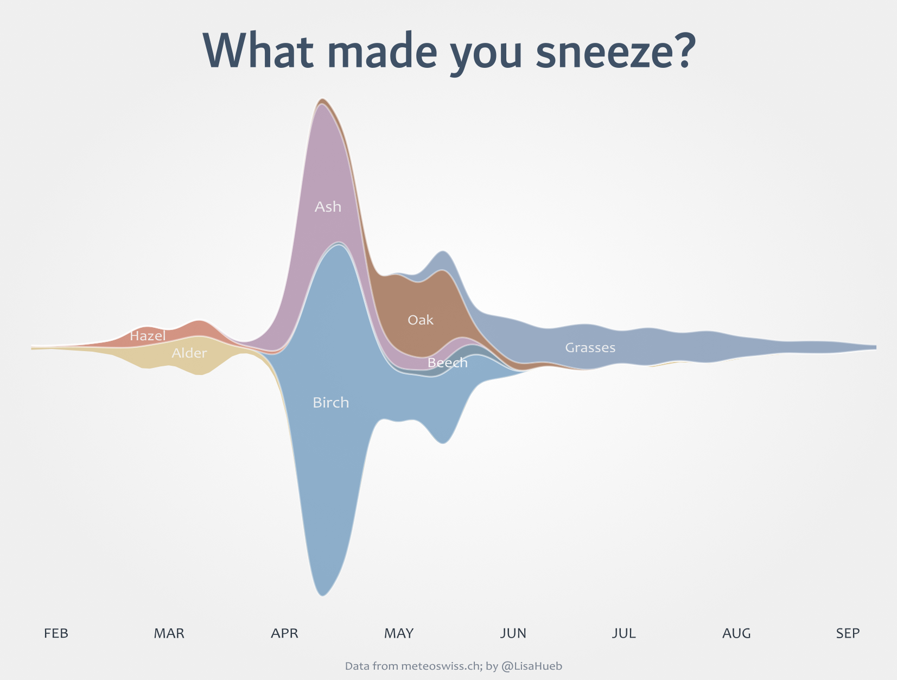

# Seasonal Pollen Activity

I used [MeteoSwiss](https://www.meteoswiss.admin.ch/services-and-publications/applications/ext/download-data-without-coding-skills.html#lang=en&mdt=normal&pgid=Pollen&sid=PBE&col=ch.meteoschweiz.ogd-pollen&di=&tr=&hdr=) to download pollen data for the past year for a single (random) location as a [CSV file](ogd-pollen_pbe_d_recent.csv).

The visualization was created in a [Jupyter Notebook](pollen_streamgraph.ipynb) using Plotly and post-processed in Inkscape.
